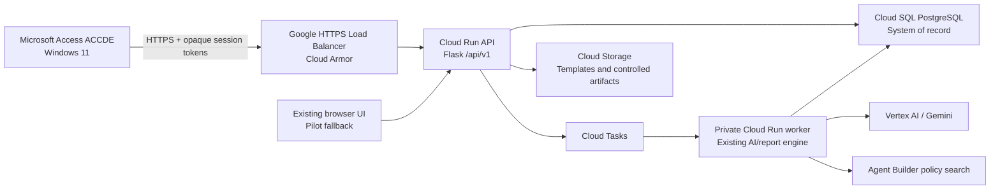

# Access + Cloud Run Master Design

**Date:** 2026-08-12 
**Status:** Approved for implementation planning 
**Selected approach:** Evolve the existing Flask/Cloud Run application and add
a Microsoft Access client 
**Target platform:** Agency-managed Windows 11 workstations with Microsoft
Access already installed

## Purpose

Convert Prison Policy AI into a centrally managed Access + Cloud Run system.
Microsoft Access becomes the Windows workstation interface. The existing Flask
application remains the trusted backend and continues to own the Google AI,
policy-search, report-generation, validation, and Word-template behavior.

The new system adds individual employee accounts, optional persistent sessions,
User and Admin roles, centralized report history, multi-officer report
preparation, immutable revisions, audit history, a production database, and a
versioned API designed for Access.

This design is the program-level contract. Five bounded specifications define
the implementation workstreams:

1. [Cloud identity foundation](2026-08-12-cloud-identity-foundation-design.md)
2. [Report storage and Access API](2026-08-12-report-storage-api-design.md)
3. [Access User client](2026-08-12-access-user-client-design.md)
4. [Access Admin Center](2026-08-12-access-admin-client-design.md)
5. [Deployment, testing, and rollout](2026-08-12-access-deployment-rollout-design.md)

Each workstream receives its own implementation plan and self-contained Claude
Code prompts after the written specifications are approved.

## Existing system to preserve

The repository is currently a Flask web application deployed to Google Cloud
Run. It already supplies:

- Policy Knowledge Expert chat backed by Vertex AI Agent Builder / Discovery
  Engine and Gemini.
- A report pipeline for classification, structured extraction, gap detection,
  report generation, validation, and disciplinary supplements.
- Deterministic anti-fabrication checks and editable generated reports.
- Official Word document generation from `templates/005_template_v3.docx`.
- A JSON/GCS-backed staff roster.
- A shared User access code and a shared Admin code.
- An administrator-only Review Lab.
- A build-free browser interface and existing regression tests.
- GitHub Actions deployment to Cloud Run through Workload Identity Federation.

The migration must reuse these working capabilities. It must not replace the AI
pipeline, prompts, policy index, report rules, templates, or current deployment
workflow without an approved requirement that specifically needs such a
change.

## Goals

- Give every employee an individual employee-number and PIN/passcode account.
- Assign each account either the User or Admin role.
- Auto-select the signed-in employee as the default reporting officer.
- Let either role optionally remain signed in on the same Windows account.
- Never put Google credentials or database credentials in Access.
- Save ordinary reports centrally and make them available from any authorized
  workstation.
- Give employees access to reports they own and reports they prepared for other
  officers.
- Give administrators search, view, edit, reopen, and export access to every
  report.
- Keep reports editable while preserving every successful save as an immutable
  revision.
- Attribute every edit, view, export, account change, and other protected action
  to the authenticated actor.
- Prevent silent overwrites during simultaneous editing.
- Preserve work during a brief network failure, Access crash, or Windows
  restart.
- Keep Word documents on-demand instead of storing every generated file.
- Deliver a compiled, signed, updateable Access application on Windows 11.
- Retain the current website during development and pilot rollout.
- Produce implementation work that can be safely divided between Codex and
  Claude Code.

## Non-goals

- A fully offline AI or report-history system.
- Direct Access-to-Cloud-SQL connections.
- Direct Access-to-Gemini or Access-to-Vertex-AI requests.
- Storing readable PINs, Google service-account keys, or long-lived cloud
  credentials on a workstation.
- Automatically filing, emailing, approving, or submitting an incident report.
- Locking a report permanently when its status becomes Completed.
- Independent duplicate copies when one employee prepares a report for another.
- Permanent deletion of reports, revisions, or audit events through Access.
- Rewriting the existing browser application before the Access client reaches
  verified feature parity.
- Importing historical Word documents automatically in the first release.

## Approaches considered

### 1. Evolve the Flask backend and add Access — selected

Add Cloud SQL, individual authentication, report persistence, revisions, audit
records, background jobs, and a versioned `/api/v1` surface. Build Access as a
thin Windows client. This approach reuses the mature AI/report engine and
allows the existing website to serve as a rollout fallback.

### 2. Make Access call the existing routes directly

This is suitable only for a disposable prototype. The existing routes use
shared codes and browser cookies, do not persist normal employee reports, and
do not provide stable Access contracts, individual authorization, revision
control, or idempotency.

### 3. Build a new backend

A clean-slate backend would duplicate functioning AI and report behavior,
increase cost and schedule, and create unnecessary parity risk. It is rejected.

## System architecture

### Microsoft Access client

- Uses the approved Guided Workspace layout.
- Provides role-aware User and Admin navigation.
- Communicates only with `/api/v1` over HTTPS.
- Holds short-lived access tokens in memory.
- Uses Windows Data Protection API (DPAPI) for an optional persistent renewal
  token and encrypted crash-recovery snapshots.
- Contains no Google secret and no Cloud SQL connection string.
- Ships to users as a compiled, digitally signed `.accde`.

### Cloud Run API

- Authenticates and authorizes every request independently of visible Access
  controls.
- Derives the actor, role, and permitted records from the server-side session.
- Owns account, session, report, revision, search, export, audit, and background
  job APIs.
- Reuses the existing report and policy modules through focused service
  boundaries rather than copying their logic into routes.
- Maintains a versioned OpenAPI contract checked into the repository.

### Cloud SQL PostgreSQL

- Becomes the authoritative source for staff, accounts, sessions, incidents,
  reports, access relationships, revisions, jobs, exports, and audits.
- Uses relational columns for identity, authorization, status, dates, and
  searchable fields.
- Uses validated JSONB snapshots for evolving extraction, generation, and
  revision payloads.
- Is never exposed directly to employee workstations.

### Background worker

- Uses the same application image and existing Python AI/report modules as the
  API service but runs as a separate authenticated Cloud Run service.
- Receives signed Cloud Tasks requests.
- Persists job stages and results so Access can close and later resume.
- Uses idempotency keys to avoid duplicate model calls and duplicate charges.

## Approved roles and permissions

| Capability | User | Admin |
|---|---:|---:|
| Create reports | Yes | Yes |
| View/edit owned reports | Yes | Yes |
| View/edit reports prepared for another officer | Yes | Yes |
| View/edit unrelated employee reports | No | Yes |
| Export permitted reports | Yes | Yes |
| View/restore permitted report revisions | Yes | Yes |
| Search all reports | No | Yes |
| Manage staff and accounts | No | Yes |
| Reset PINs and revoke sessions | No | Yes |
| Assign User/Admin roles | No | Yes |
| View immutable audit records | No | Yes |
| Permanently delete reports or audits | No | No |

Access hiding a button is never an authorization boundary. Cloud Run enforces
the matrix for every endpoint and record.

## Account and session decisions

- Employee number is the sign-in identifier.
- PIN/passcodes contain 4 through 8 ASCII letters or digits. Letters are
  case-insensitive and normalized before hashing.
- Six through eight characters are recommended; four remains supported.
- PINs use Argon2id one-way hashes with per-hash salts. Readable PINs are never
  stored, returned, or logged.
- Administrators create accounts and issue temporary PINs but cannot view a
  current PIN.
- Temporary PINs expire after 24 hours and require replacement at first use.
- Five consecutive failed attempts create a 15-minute account lock. Repeated
  lock cycles double to 30 and then 60 minutes, capped at 24 hours. A successful
  sign-in resets the failure state.
- PIN reset, PIN change, role change, account deactivation, or explicit
  revocation invalidates affected renewal tokens.
- Both User and Admin accounts may select **Keep me signed in on this Windows
  account**.
- All open Access sessions use a rotating renewal token in memory so a work
  session can last longer than the 15-minute access token. Without persistence,
  the token is never written to disk and expires within 12 hours.
- Persistent renewal tokens are DPAPI-encrypted for the current Windows user,
  rotated after every use, and expire after 30 days of inactivity.
- Admin accounts remain signed in when persistence is selected, but the Admin
  Center locks after 15 minutes of inactivity. Unlocking it requires the
  administrator PIN and is not a full account sign-in.
- PIN reset, role change, account deactivation, bulk export, and other sensitive
  administrator changes require a PIN-confirmed step-up token no older than five
  minutes.

## Report ownership and collaboration decisions

An incident workspace holds field notes, facts, people, gaps, charges, and one
or more reports. Each report has exactly one reporting officer and one initial
preparing officer.

When Officer A prepares a report for Officer B:

- Officer B is the reporting officer and owner.
- Officer A is the preparer.
- Officer B sees the canonical report under **My Reports**.
- Officer A sees the same canonical report under **Reports I Prepared**.
- Both may edit the same record.
- Administrators may view and edit it.
- Every revision identifies the actual editor.
- No independent copy is created.

One incident may contain separate reports owned by multiple reporting officers.
Shared incident facts do not collapse those reports into one narrative.

Reports remain editable. Status is organizational only:

- In Progress
- Completed
- Archived

Restoring an earlier version creates a new revision containing that historical
content; it never removes later revisions.

## Approved Access experience

### User Guided Workspace

The left navigation contains Home, New Report, My Reports, Reports I Prepared,
Policy Expert, and Account. A six-step report workflow guides the employee:

1. Choose reporting officer or officers.
2. Enter field notes.
3. Review AI classification and extracted facts.
4. Answer missing-information questions or explicitly mark unknown values.
5. Review and edit every generated report.
6. Generate the Word document when needed.

The interface continuously shows connection and save state. AI output remains
a draft. Nothing files itself.

### Admin Guided Workspace

Admin accounts retain the normal reporting navigation and gain Administration:
Overview, All Reports, Accounts & Staff, Audit Log, and System Health.

The interface clearly labels administrator views and edits of another
employee's report. Opening, editing, revising, restoring, or exporting another
employee's report is audited.

## Data and API conventions

- Access uses only `/api/v1` routes; legacy browser routes remain isolated.
- Every response includes a request ID and server time.
- Errors include a stable machine-readable code, safe human message, retryability
  flag, and request ID.
- Every modifying request includes an idempotency key and Access client version.
- Report saves also include the revision opened by the client.
- Stale saves return HTTP 409 with current revision metadata and never overwrite
  newer work.
- List/search endpoints are paginated, bounded, and authorization-filtered.
- Client-supplied employee numbers never establish identity or permissions.
- The API publishes its latest and minimum compatible Access versions.

## Saving, recovery, and AI availability

- Access autosaves 60 seconds after the last change.
- Every successful cloud save creates an immutable report revision.
- Before a save, Access writes a DPAPI-encrypted local recovery snapshot.
- The snapshot is removed after confirmed cloud persistence.
- On an unexpected close, Access offers recovery and comparison at next start.
- Orphaned recovery snapshots expire after seven days.
- A network or Google AI outage never clears visible work.
- Manual report editing and cloud saves remain available when Google AI is
  unavailable.
- Classification, extraction, and generation run as resumable background jobs.
- Repeated submission with the same idempotency key returns the same job.

The UI uses explicit states: Saved, Saving, Unsaved changes, Reconnecting, and
Save failed—work preserved.

## Word documents

Word documents are generated on demand from a specific saved revision. The
system records the report, revision, exporter, template version, timestamp, and
SHA-256 output hash. It returns the document to the employee but does not retain
the binary document centrally in the first release.

## Security and privacy

- Production API traffic uses a managed HTTPS endpoint behind a Google HTTPS
  load balancer and Cloud Armor.
- Cloud Run accepts external API traffic only from the load balancer.
- Cloud SQL is reachable only by the Cloud Run service identities.
- The worker accepts only authenticated Cloud Tasks invocations.
- Service accounts are single-purpose and least-privileged.
- Secret Manager holds application secrets.
- Production and test use isolated databases and cloud environments.
- Ordinary logs exclude PINs, renewal tokens, names, employee numbers, inmate
  identifiers, field notes, and narratives.
- Protected audit records contain actor/action/target/result metadata rather
  than duplicate report content.
- Access recovery payloads and persistent renewal tokens are DPAPI-encrypted.
- Reports, revisions, and audits are retained indefinitely until an approved
  agency records schedule replaces that default. Access and public APIs provide
  no permanent-delete operation.

## Access delivery and updates

- Development uses an editable `.accdb`; users receive a compiled `.accde`.
- Exported VBA modules, classes, forms, queries, and API contract artifacts are
  stored as text in source control alongside the source database.
- Releases are digitally signed and installed in an IT-approved local trusted
  location.
- VBA declarations support both 32-bit and 64-bit Access using VBA7/Win64
  conditional compilation.
- A signed update helper verifies the Authenticode signature and published
  SHA-256 hash, waits for Access to close, retains the previous release,
  atomically replaces the client, validates startup, and rolls back on failure.
- Compatible old clients receive an update notice. Clients older than the
  server-published minimum become read-only until updated.

## Delivery workstreams and sequencing

The implementation order is dependency-driven:

1. Cloud database, migrations, staff/accounts, authentication, sessions,
   authorization, and audit foundation.
2. Incident/report persistence, ownership/access, revisions, search, exports,
   background AI jobs, and `/api/v1` contract.
3. Access User client foundation, authentication, Guided Workspace, report
   workflow, history, recovery, Policy Expert, and Word export.
4. Access Admin Center, all-report oversight, account/roster controls, audit,
   health, and step-up operations.
5. Production infrastructure, signing/updater, end-to-end testing, pilot,
   training, rollout, and operating procedures.

Later workstreams may begin only after the interfaces they consume are
implemented, tested, and committed. Codex and Claude Code must not edit the
same files concurrently.

## Codex and Claude Code collaboration contract

After specification approval, each implementation task receives a
self-contained prompt under `docs/claude-prompts/`. Every prompt must include:

- Objective and user-visible outcome.
- Required repository instructions and design/plan files to read.
- Expected starting branch and base commit.
- Exact allowed files and forbidden scope.
- Interfaces consumed and produced.
- Test-first steps and exact commands.
- Expected failure before implementation and success afterward.
- Security, privacy, and logging constraints.
- Explicit non-goals.
- Acceptance criteria.
- Required commit message.
- Handoff format containing commit SHA, changed files, commands/results,
  assumptions, risks, and unresolved blockers.
- Instructions to stop on conflicting requirements and never deploy, push,
  delete data, or expose credentials without explicit authorization.

One worker owns a task. Another worker reviews the committed result against the
specification and tests before dependent work begins.

## Program acceptance criteria

1. An active employee can sign in with employee number and PIN from an
   authorized Windows 11 workstation.
2. User and Admin accounts may optionally restore a Windows-bound persistent
   session without storing a readable credential.
3. PIN resets, account changes, role changes, lockouts, session revocation, and
   administrator step-up behave as specified and are audited.
4. A signed-in employee is auto-selected as reporting officer but may prepare a
   canonical report owned by another active roster member.
5. Owners and preparers can access the same shared report; unrelated Users
   cannot access it; Admins can.
6. Ordinary reports persist centrally and are available from any authorized
   workstation.
7. Every successful save creates an immutable, attributable revision.
8. A stale save cannot silently replace a newer revision.
9. A crash or brief network interruption preserves recoverable unsaved work.
10. AI jobs survive Access closing, are resumable, and do not duplicate work or
    cost for a repeated idempotent request.
11. The existing report validation, anti-fabrication, policy citations, and Word
    output remain functionally equivalent unless an approved requirement says
    otherwise.
12. Administrators can search, view, edit, restore, and export every report,
    with those actions recorded.
13. Word output is generated from a named revision and its metadata is audited
    without retaining the binary centrally.
14. Access contains no Google or database credentials and cannot bypass Cloud
    Run authorization.
15. The signed `.accde` works on every Access version/bitness included in the
    production workstation inventory.
16. Automated tests, Windows acceptance tests, security review, backup restore,
    and pilot acceptance all pass before general rollout.
17. The existing website remains available as a controlled fallback until the
    Access release receives written production acceptance.
